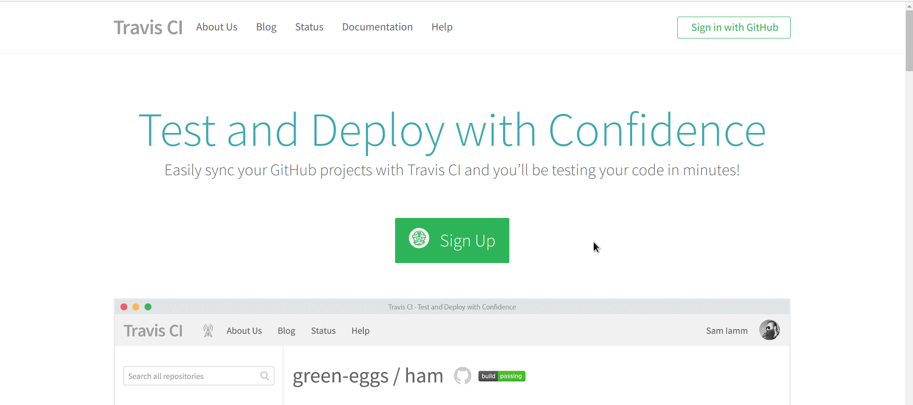

```{r setup, echo=FALSE}
knitr::opts_chunk$set(
	echo = FALSE,
	message = TRUE,
	warning = FALSE,
	fig.align = 'center'
)
library(knitr)
```


class: inverse, center, middle

# Travis & Continuous Integration

???
我今天要谈的是 R Markdown 结合 Travis 的应用，目标是希望听众能认识到 Travis 这个服务，并能将其结合到 R Markdown 的工作流程中，自动化许多繁琐的工作。

所以，虽然演讲题目当中有 R Markdown，但接下来的 20 多分钟，我讲的多半是 Travis 而非 R Markdown。当然，Travis 的应用还是围绕着 R Markdown 为目的。


---

## What is Travis?


--

<br>


---

## What is Travis?


--
&nbsp;&nbsp;&nbsp;&nbsp;

???
那 Travis 到底是什么呢？在回答这个问题前，我们必须先知道什么是「持续集成 (Continuous Integration)」。持续集成是一种软件开发的流程，它的想法是尽量让开发过程中，每次源码更新或改变时，能自动进行一连串的检查，确保添加或修改的程序码不会破坏整个软件项目，进而减少软件开发过程中的风险。

Travis 则是为 GitHub repo 里的项目提供持续集成的一套服务。简单来说，每次你将 commit push 到 GitHub 时，Travis 就会自动地去跑一连串的检查，确认刚刚的 commit 没有破坏整个项目。


---

## Travis 跟 R Markdown 有何干系？

<br>

```{r out.width='85%'}

```


???
现在你可能会有疑问，Travis 是种为软件开发者提供的服务，但它对于 R Markdown 的用户能有什么帮助？

前面所介绍的其实仅是 Travis 的「默认功能」，但事实上，我们可以要求 Travis 做「任何事」，因为 Travis 运作的方式是提供一个完整的 Ubuntu (或 Mac) 环境，让自动化测试能够进行。我们只要更改 Travis 的默认行为，亦即，不让它进行自动测试而是去运行其它我们写的指令，Travis 其实就变成了我们的另一台个人电脑。

---

class: inverse, center, middle

# Using Travis

---

```{r out.width='38%'}

```


.smaller[
> I've been using travis for quite some years, and this is still what my commit history looks like when trying to set up a new configuration
>
> — Hadley Wickham (@hadleywickham) [December 11, 2018](https://bit.ly/2U9ewu6)

]

???
接下来，我将说明如何设置 Travis。这边默认听众已具有使用 Git 与 GitHub 的经验。


---


## 注册 Travis 帐号

- [travis-ci.org](https://travis-ci.org) ➜ Sign in with GitHub ➜ 完成



???
首先我们需要注册 Travis 的帐号。我们进入到 [travis-ci.org](https://travis-ci.org) 后，直接使用 GitHub 帐号登录，如此就能将 Travis 链接到 GitHub。

---

## GitHub Repo 设置

1. `DESCRIPTION`
    - 无功能但必要
    
    - 让 Travis 以为 Repo 是 R 套件
    
    - 内容：
          ```yaml
          Package: fakepkg
          Title: fakepkg
          Version: 1.0.0
          ```
    
1. `.travis.yml`
    - 设置 Travis 指令

???
Travis 要能在 GitHub Repo 中侦测到必要的文件，它才能正确的运行任务。就 R 语言的项目，GitHub repo 的根目录中必须有 `DESCRIPTION` 以及 `.travis.yml` 这两个文件才行。`DESCRIPTION` 这个文件是每个 R 套件都需具备的文件，这边我们虽然没有要创建 R 套件，但它存在的目的是为了欺骗 Travis，让它以为这个 GitHub repo 是 R 套件的项目。


---

## .smaller[**`.travis.yml`**]

.left-column[
### 内容 <a href='https://github.com/liao961120/bookdown-crc-travis/blob/master/.travis.yml' style='font-size: 0.35em;'> GitHub</a>
]

.right-column[

```{r results='asis'}
printstr <- paste(readLines('../.travis.yml'), collapse = '\n')

cat('```yml\n', printstr, '```\n', sep = '')
```
]


---

## .smaller[**`.travis.yml`**]

.left-column[
### 内容
]

.right-column[

```{r}

```

]

---

## .smaller[**`.travis.yml`**]

.left-column[
### 内容
### Environment
]

.right-column[

设置**语言 (R)**, **操作系统**, **GitHub Branch**

```yml
language: r
dist: trusty
sudo: true
branches:
  only:
    - master
```
]

---

## .smaller[**`.travis.yml`**]

.left-column[
### 内容
### Environment
### Dependencies
]

.right-column[

安装 **R 包**, **System Requirements**<sup>\*</sup>, **LaTeX** 与 **Pandoc** 等

```yml
pandoc_version: 2.3.1
latex: false      # tinytex is better
before_install:   # 安装 R 包以外 dependencies
  - sudo apt-get update
r_packages:       # 安装 CRAN 上的 R 包
  - bookdown
  - tinytex
  - ggplot2
r_github_packages:  # 安装 GitHub 上的 R 包
  - r-lib/pkgdown
cache:
  packages: yes  # 缓存下载之 R 包, 加快 Travis 速度
```
]

.smaller[
.footnote[
[\*]: 例如 [`xml2`](https://bit.ly/2uziugw) 在 Ubuntu 上需要 R 包以外的软件 (`libxml2-dev`) 才能运作。
]
]


---

```{r include=FALSE}
run_commands <- '.smaller[**`.travis.yml`**]

.left-column[
### 内容
### Environment
### Dependencies
### .little-smaller[Run Commands]
]
'
```

## `r asis_output(run_commands)`

.right-column[

可以很简单，也可以很复杂

- Minimum skills required
    - file manipulation (`bash` or `R`)

- Advanced
    - docker, command line tools, download binaries, ...
    - The sky is the limit

]

---

## `r asis_output(run_commands)`

.right-column[

### .smaller[基本 Command Line 指令 (bash)]

#### 运行 R 指令
```bash
R -e 'bookdown::render_book("index.Rmd")'
Rscript build.R
```

#### File Manipulation<sup>\*</sup>

```bash
if [[ -d docs ]]; then rm -r docs; fi
mkdir docs
cp -r _book/* docs
```
]


.smaller[.footnote[
[\*]: R 亦可进行 file manipulation，参考 [R File Manipulation](https://bit.ly/2UfzMhe) 与 [R Functions for Linux Commands](https://bit.ly/2uCu7n6)。
]]

---

## `r asis_output(run_commands)`

.right-column[

### Wrap up — .smaller[**`script`**]:

* .smaller[.red[Current working directory]: Cloned GitHub repo]

1. 
```yml
script:
    - R -e 'tinytex::install_tinytex()'
    - R -e 'bookdown::render_book("index.Rmd", output_format = "bookdown::gitbook")'
    - R -e 'bookdown::render_book("index.Rmd", output_format = "bookdown::pdf_book")'
    - if [[ -d docs ]]; then rm -r docs; fi
    - mkdir docs
    - cp -r _book/* docs
```

1. 
```yml
script:
    - bash build.sh
```
   
1. 
```yml
script:
    - Rscript build.R
```
]


.footnote[
.smaller[
源码 [`build.sh`](https://bit.ly/2OC5UGB), [`build.R`](https://bit.ly/2FNhAn4)
]]

???
现行工作目录


---

## `r asis_output(run_commands)`

.right-column[

### Bypassing Build Failure .much-smaller[(Advanced)]

1. **`script`**
    - 覆盖默认之 `R CMD Check`
    - 运行正常
      (➜ 运行 **`after_success`**)
    - 运行出错 ➜ 
      (➜ 运行 **`after_failure`**)
   
1. **`after_success`**
    
    - 不影响 build result
    - 
    ```yaml
    script:
        - echo "Bypassing script"
    after_success:
        - bash build.sh
    ```
]

???
依据顺序运行

换言之，若 `.travis.yml` 中没有 **`script:`**， Travis 会自动进行 R CMD Check。  
在此情形下，必然导致 

---

```{r include=FALSE}
deploy <- '.smaller[**`.travis.yml`**]

.left-column[
### 内容
### Environment
### Dependencies
### .little-smaller[Run Commands]
### Deploy
]'
```

## `r asis_output(deploy)`


.right-column[

```yml
deploy:
* - provider: pages
    github-token: $GH_TOKEN
    #target-branch: <name>  # 默认: `gh-pages`
    skip-cleanup: true 
    keep-history: false 
    local-dir: docs
    on:
      branch: master
```

* 将 build 结果传回 GitHub Repo

]

---

## `r asis_output(deploy)`

.right-column[

```yml
deploy:
  - provider: pages
*   github-token: $GH_TOKEN
    #target-branch: <name>  # 默认: `gh-pages`
    skip-cleanup: true 
    keep-history: false 
    local-dir: docs
    on:
      branch: master
```

1. [GitHub Personal access token](https://github.com/settings/tokens) ➜ Generate new token  
➜ scope: `public_repo` ➜ copy token

1. [travis-ci.org/`<user>`/`<repo>`/settings](https://travis-ci.org/liao961120/bookdown-crc-travis/settings)  
➜ Environment Variables  
➜ `Name` = `GH_TOKEN`, `Value` = token from 1.
]


---

## `r asis_output(deploy)`

.right-column[
```yml
deploy:
  - provider: pages
*   github-token: $GH_TOKEN
    #target-branch: <name>  # 默认: `gh-pages`
    skip-cleanup: true 
    keep-history: false 
    local-dir: docs
    on:
      branch: master
```

```{r out.width='80%'}

```
]

---

## `r asis_output(deploy)`

.right-column[
```yml
deploy:
  - provider: pages
    github-token: $GH_TOKEN
*   target-branch: travis-build  # 默认: gh-pages
    skip-cleanup: true 
    keep-history: false 
    local-dir: docs
    on:
      branch: master
```

* 使用 `gh-pages` 以外的 branch
]

---

## `r asis_output(deploy)`

.right-column[
```yml
deploy:
  - provider: pages
    github-token: $GH_TOKEN
    #target-branch: travis-build  # 默认: gh-pages
    skip-cleanup: true 
    keep-history: false 
*   local-dir: docs
    on:
      branch: master
```

* [Reminder](#18):

    ```yml
    script:
       ...
    *  - mkdir docs
    *  - cp -r _book/* docs
    ```
]

---

## `r asis_output(deploy)`

.right-column[
```yml
deploy:
  - provider: pages
    github-token: $GH_TOKEN
    #target-branch: travis-build  # 默认: gh-pages
    skip-cleanup: true 
    keep-history: false 
    local-dir: docs
*   on:
*     branch: master
```

* Travis was [told](#14) to run on `master` branch:

    ```yml
    language: r
      ...
    * branches:
    *   only:
    *     - master
    ```
]

---

## `r asis_output(deploy)`

.right-column[

- Push to GitHub ➜ Travis build auto-triggered  
➜ build success ➜ Web site served at
[`<user>`.github.io/`<repo>`](https://liao961120.github.io/bookdown-crc-travis)

- 亦可手动直接在 Travis 网页上 trigger build:

    [travis-ci.org/`<user>`/`<repo>`](https://travis-ci.org/liao961120/bookdown-crc-travis) ➜ More options ➜ Trigger build
]

