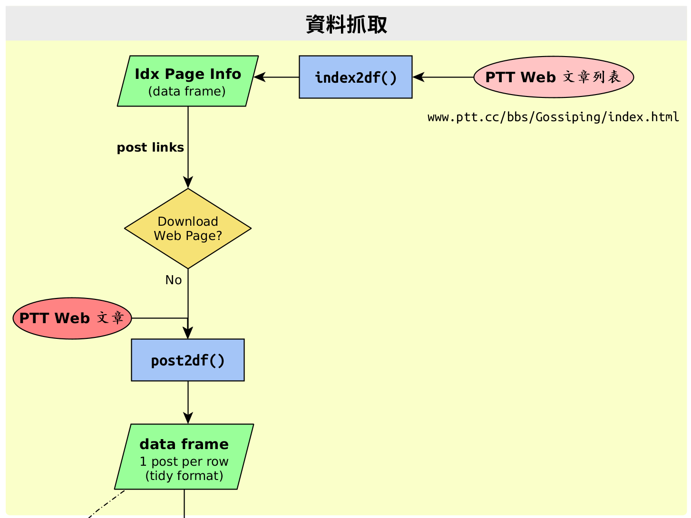
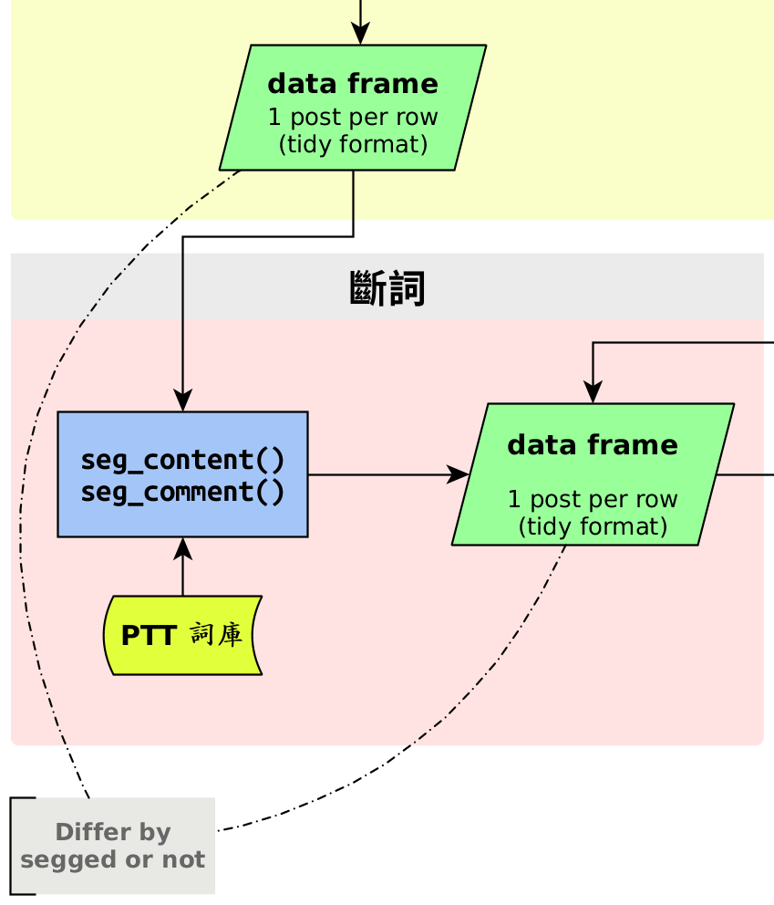
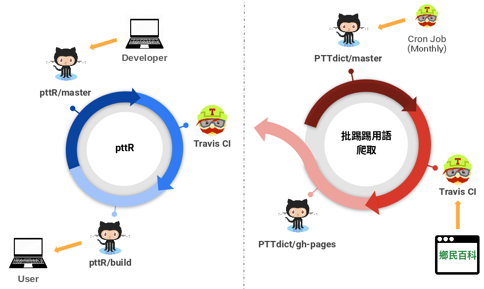

```{r setup, include=FALSE}
knitr::opts_chunk$set(
	echo = FALSE,
	message = FALSE,
	warning = FALSE,
	out.width = '60%'
) 
library(knitr)
```

## 巨人的肩膀 {.smaller}

```{r out.width='30%'}
include_graphics('http://r-pkgs.had.co.nz/cover.png')
```

[Read Online](http://r-pkgs.had.co.nz/)

<br>

> - [Analyses as Packages](https://rmflight.github.io/post/analyses-as-packages/)


## Outline

- pttR 簡介
    - 目標
    - 資料抓取(操作)
    - 斷詞(操作)
- 批踢踢詞(?)庫
    - 鄉民百科、用語擷取規則
    - 自動更新


# pttR 簡介

## pttR 目標

1. 減輕抓取 PTT 資料的負擔

1. 符合 PTT 的斷詞處理

1. 與 R Text Mining 套件銜接

<br>

> * `r include_graphics('ptt-goal.png')`


## How pttR Works

```{r out.width='70%'}
include_graphics("pttR-dataflow.png")
```

## Get Started {.smaller}

```r
devtools::install_github("liao961120/pttR", ref = "build")
```

#### 範例程式碼 

```{r echo=TRUE, eval=FALSE}
library(dplyr)

# 資料抓取
### <b>
idx_df <- pttR::index2df("gossiping", newest = 1)
### </b>
pst_df <- idx_df$link[1:5] %>% 
### <b>
  pttR::as_url() %>%
  pttR::post2df()
### </b>

# 斷詞
pst_df_segged <- pst_df %>%
### <b>
  mutate(content = pttR::seg_content(content),
         comment = pttR::seg_comment(comment))
### </b>

# 第一篇文章的留言
pst_df_segged$comment[[1]]

# Construct Corpus Object
### <b>
post_qcorp <- pttR::post2qcorp(pst_df_segged) # Corpus object
cmt_qcorp <- pttR::comment2qcorp(pst_df_segged) # Corpus list-col in df
### </b>
```


## 資料抓取 {.smaller}

```{r out.width='60%'}

```


- [PTT 網頁](https://www.google.com.tw/search?q=ptt&oq=ptt+&aqs=chrome..69i57j69i60l4j0.2475j0j4&client=ubuntu&sourceid=chrome&ie=UTF-8)
    
> -   
    `index2df()` $\equiv$ [www.ptt.cc/bbs/*看板名稱*/index.html](https://www.ptt.cc/bbs/Gossiping/index.html) <br><br>
    `post2df()` $\equiv$ [www.ptt.cc/bbs/*看板名稱*/xx..xx.html](https://www.ptt.cc/bbs/Gossiping/M.1537945316.A.015.html)

Demo

## 斷詞 {.smaller}
```{r out.width='30%'}

```

- jiebaR
- user dictionary ([批踢踢用語](https://liao961120.github.io/PTT-scrapy/))

> - `dplyr::mutate()` + `pttR::seg_content()` + `pttR::seg_comment()`

<br><br>
([Demo](https://www.ptt.cc/bbs/Gossiping/M.1537945316.A.015.html))

# 批踢踢詞庫

## 鄉民百科資料擷取

- [PTT鄉民百科](http://zh.pttpedia.wikia.com/wiki/)

- Scrapy
    - Start URLs:  
      流行用語、鄉民文化、流行符號、基本用語、PTT名人、看板、事件、相關事物
    - [PTT用語](https://liao961120.github.io/PTT-scrapy/)來源
        - `<h1 class="page-header__title">` (標題)
        - `<b>` (粗體)
        - `<a class="new">` (紅字)
        - `「`、`」` (上、下引號)

## 自動更新

```{r out.width="90%"}

```

## 相關連結

- [pttR](https://liao961120.github.io/pttR) ([Vignette](https://liao961120.github.io/pttR/articles/data-retreive.html), [GitHub](https://github.com/liao961120/pttR))

- [批踢踢用語](https://liao961120.github.io/PTT-scrapy/) ([GitHub](https://github.com/liao961120/PTT-scrapy/tree/master/PTTdict))

- [PTT鄉民百科](http://zh.pttpedia.wikia.com/wiki/)

